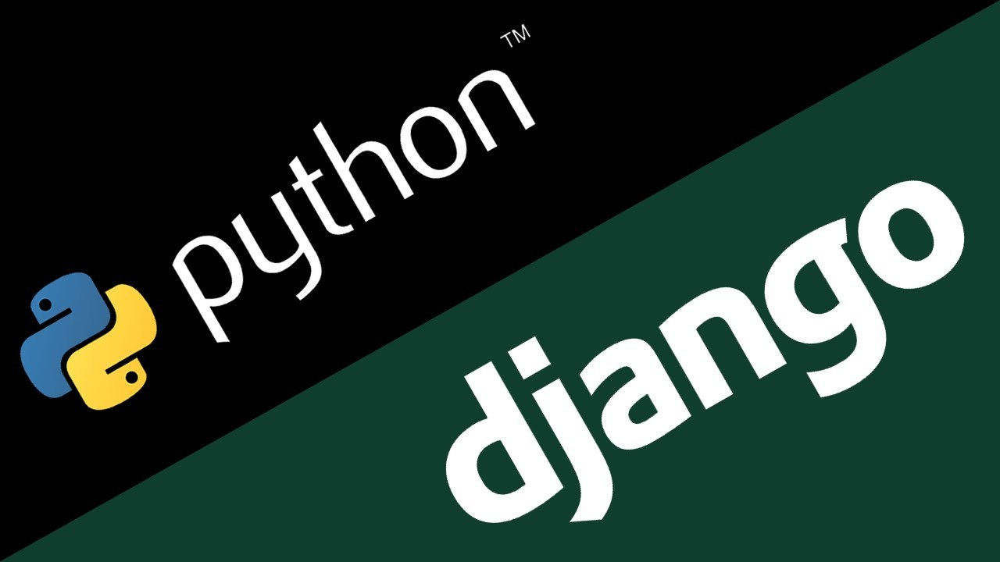

# Django_seiko_shop




Django_seiko_shop an intermediate shop app Written with <a href="https://www.python.org">Python 3.9</a> and <a href="https://www.djangoproject.com/">Django Framework</a> 3.2.
 
The purpose of this project was to see how to build a shop app with Django .


# How to install this project

### Clone the project

```shell
git clone https://github.com/amirpsd/django_seiko_shop.git && cd django_seiko_shop && cp .env-sample .env && cp .env.db-sample .env.db
```

### install docker

You must have Docker installed on your system 

- [install in Linux](https://docs.docker.com/engine/install/)
- [install in Windows](https://docs.docker.com/desktop/windows/install/)
- [install in Mac](https://docs.docker.com/desktop/mac/install/)


### create docker network 
```shell
docker network create web_network
docker network create nginx_network
```

### create docker volume 
```shell
docker volume create seiko_postgresql
docker volume create src_static_volume
docker volume create src_media_volume
```

### run project
```shell
docker-compose up --build -d
```
### run nginx container
```shell
cd nginx
docker-compose up --build -d
```
congratulations. You have successfully run the project.

### Important

If you do not have Google recaptcha code,take the link below and add it to .env (PUBLIC_KEY) and (PRIVATE_KEY) 

https://www.google.com/recaptcha/about/


### LICENSE
see the [LICENSE](https://github.com/amirpsd/django_seiko_shop/blob/main/LICENSE) file for details